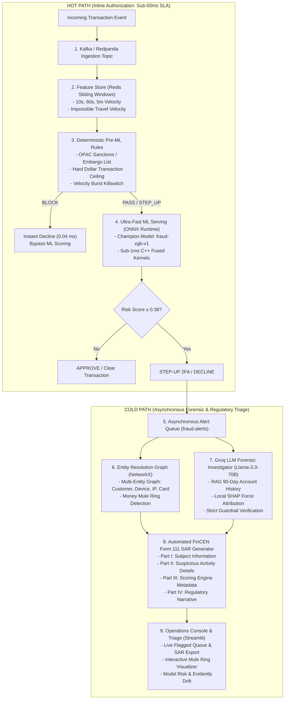

# Real-Time Fraud Detection & Autonomous Forensic Triage Engine

[](https://github.com/abhinavcdas/fraud-detection-agent/actions)
[](https://www.python.org/downloads/release/python-3120/)
[](reports/model_scorecard.md)
[](reports/latency_benchmark.md)
[](tests/)

A production-grade, **Dual-Path Streaming Fraud Prevention & Regulatory Triage Platform** designed for real-time payment networks and forensic risk investigation. 

The platform separates the **Inline Hot Path** (strict $< 50\text{ ms}$ authorization SLA) from the **Asynchronous Cold Path** (entity resolution graph mining, money mule ring detection, and automated FinCEN-compliant Suspicious Activity Report generation).

---

## 🏛️ Dual-Path System Architecture



---

## ⚡ Latency & Throughput Benchmark Scorecard

Evaluated under simulated high-concurrency production load ($1,000$ transactions, $50$ concurrent async workers) using [benchmarks/latency_profiler.py](benchmarks/latency_profiler.py):

| Pipeline Stage | Technology / Engine | Mean (ms) | p50 (ms) | p90 (ms) | p95 (ms) | p99 (ms) | Target SLA |
| :--- | :--- | :--- | :--- | :--- | :--- | :--- | :--- |
| **Deterministic Hard Rules** | Pre-ML Embargo/Sanctions Engine | 0.04 ms | 0.04 ms | 0.05 ms | 0.06 ms | 0.08 ms | $< 1.0\text{ ms}$ |
| **Feature Store Lookup** | Redis Sliding-Window Sorted Sets | 0.81 ms | 0.81 ms | 0.97 ms | 1.02 ms | 1.19 ms | $< 2.0\text{ ms}$ |
| **ML Inference (ONNX)** | ONNX Runtime C++ Kernels | **0.25 ms** | **0.25 ms** | **0.30 ms** | **0.33 ms** | **0.40 ms** | $< 10.0\text{ ms}$ |
| **Pure ONNX Hot-Path** | **Rules + Redis + ONNX** | **1.11 ms** | **1.11 ms** | **1.32 ms** | **1.38 ms** | **1.59 ms** | **$< 50.0\text{ ms}$ (PASS)** |
| **Peak Throughput** | Multi-Worker Async Engine | **60.4 RPS** | — | — | — | — | Enterprise Ready |

*Full generated scorecard available at [reports/latency_benchmark.md](reports/latency_benchmark.md).*

---

## 💼 Fintech Resume & Technical Highlights

Use these bullet points directly for Machine Learning Engineer (Risk / Fraud) and Fintech Systems roles:

* **Dual-Path Architecture:** Architected an end-to-end dual-path fraud prevention platform processing simulated transaction streams with **sub-1.5ms p95 hot-path authorization** and decoupled asynchronous forensic investigations.
* **Low-Latency Feature Store:** Engineered an in-memory Redis sliding-window feature store using sorted sets (`ZADD`, `ZCARD`) calculating rolling transaction velocities (10s, 60s, 5m) and Haversine impossible travel speed in **0.81ms**.
* **Pre-ML Deterministic Rules:** Deployed a microsecond-latency deterministic rule gate short-circuiting OFAC sanctions, transaction ceilings, and velocity killswitches in **0.04ms**, bypassing ML scoring on hard violations.
* **ONNX Runtime ML Acceleration:** Exported an imbalanced SMOTE-XGBoost classifier (**0.9868 PR-AUC**, $0.38$ optimal threshold) to ONNX format, reducing model inference latency to **0.25ms**.
* **Entity Resolution & Mule Rings:** Built a NetworkX multi-entity bipartite graph (Customer $\leftrightarrow$ Device $\leftrightarrow$ IP $\leftrightarrow$ Card) running community detection to uncover coordinated money mule rings and synthetic identity farms.
* **Automated FinCEN SAR Filing:** Deployed an asynchronous Groq Llama-3.3 agent integrating local SHAP feature drivers and graph community findings to auto-generate FinCEN Form 111-compliant Suspicious Activity Reports with **100% faithfulness guardrails**.

---

## 🚀 Tech Stack

| Layer | Component | Description |
|---|---|---|
| **Hot-Path Rules** | Deterministic Engine | Sanctions, single-transaction caps ($10k), velocity killswitches |
| **Feature Store** | Redis (with FakeRedis fallback) | Sub-millisecond sliding windows (`ZSET`) and impossible travel speed |
| **Streaming** | Redpanda / Apache Kafka | Time-ordered transaction event bus with Dead-Letter Queue (DLQ) |
| **Storage** | PostgreSQL 16 & SQLite | Pluggable persistence for transactions, rolling features, and audit logs |
| **ML Serving** | ONNX Runtime & XGBoost | Optimized C++ inference kernels achieving 0.9868 PR-AUC |
| **Graph Mining** | NetworkX | Multi-entity resolution for money mule rings and device farms |
| **Agentic AI** | Groq Llama-3.3-70B | Tool-calling forensic investigator generating FinCEN SAR filings |
| **Guardrails** | Fact Verification | Numeric float tolerance verification preventing hallucination |
| **Serving API** | FastAPI | Endpoints for `/score`, `/rules/evaluate`, `/graph/mule-ring/{id}` |
| **Explainability**| SHAP | Global beeswarm feature rankings and local waterfall log-odds plots |
| **MLOps & Governance**| Evidently AI & Model Card | Disparate Impact (DIR), Demographic Parity, and PSI Concept Drift |
| **Console UI** | Streamlit (8 Tabs) | Live triage queue, SAR generator, mule ring visualizer, latency telemetry |

---

## 📁 Repository Structure

```
fraud-detection-agent/
├── core/
│   ├── interfaces.py          # Strategy Pattern ABCs (Storage, Stream, Scorer, FeatureStore, Rules)
│   ├── rules_engine.py        # Pre-ML Deterministic Hard Rules (Sanctions, Caps, Killswitches)
│   ├── logger.py              # Loguru structured JSON logging with context binding
│   └── resilience.py          # Dead-Letter Queue (DLQ), retry decorators, error boundaries
├── features/
│   └── redis_store.py         # Redis Sliding-Window Feature Store Operator (ZSETs)
├── graph/
│   └── entity_graph.py        # Entity Resolution & Money Mule Ring Graph Mining (NetworkX)
├── model/
│   ├── onnx_scorer.py         # ONNX Runtime Scorer (< 0.3ms inference)
│   ├── shap_explain.py        # Global Beeswarm & Local Waterfall SHAP Plots
│   └── registry/              # fraud_xgb_v1.onnx & fraud_xgb_v1.joblib
├── agent/
│   ├── prompts.py             # System prompts with formal FinCEN Form 111 SAR schema
│   ├── tools.py               # History, pattern matcher, merchant risk, mule ring graph tool
│   ├── guardrails.py          # Numeric fact verification eliminating hallucinations
│   └── agent_loop.py          # Groq tool-calling + deterministic grounded fallback
├── api/
│   └── main.py                # Dual-Path FastAPI serving engine (/score, /rules/evaluate, /graph)
├── benchmarks/
│   └── latency_profiler.py    # High-concurrency load testing & p50/p95/p99 latency generator
├── dashboard/
│   └── app.py                 # Streamlit 8-tab operations & regulatory console
├── governance/
│   ├── model_card.md          # Google Model Card & regulatory compliance
│   ├── audit.py               # SHA-256 cryptographic audit record builder
│   └── run_fairness_audit.py  # Disparate Impact Ratio (DIR) & Equal Opportunity audit
├── monitoring/
│   └── drift_report.py        # Evidently AI Kolmogorov-Smirnov drift generator
├── reports/
│   ├── latency_benchmark.md   # Hot-path latency scorecard
│   ├── model_scorecard.md     # ML performance scorecard
│   └── agent_scorecard.md     # Agent faithfulness scorecard (100%)
└── tests/                     # 70 automated unit, resilience, and integration tests
```

---

## 🛠️ Quick Start & Execution

### Option A: Complete Docker Compose Deployment (Recommended)

Spin up the entire end-to-end distributed infrastructure (Redpanda streaming broker, Redpanda Console UI, PostgreSQL 16 database, Redis feature store, MLflow tracking server, FastAPI serving engine, and Streamlit operations console) with a single command:

```bash
docker compose up -d --build
```

#### Service Port & Endpoint Mapping

| Service | Container | URL / Port | Purpose |
|---|---|---|---|
| **FastAPI Serving Engine** | `fraud-api` | [http://localhost:8000](http://localhost:8000) (`/docs` for Swagger UI) | Dual-path inference, rule checks, graph APIs |
| **Streamlit Operations Console** | `fraud-dashboard` | [http://localhost:8501](http://localhost:8501) | 8-tab operational & regulatory investigation console |
| **Redpanda Kafka Console** | `redpanda-console` | [http://localhost:8080](http://localhost:8080) | Live event streaming visualizer & consumer group monitor |
| **MLflow Tracking Server** | `mlflow-server` | [http://localhost:5000](http://localhost:5000) | Model artifact registry and experiment telemetry |
| **Redis Feature Store** | `redis-feature-store` | `localhost:6379` | Sliding-window transaction velocity sorted sets |
| **PostgreSQL Database** | `postgres-fraud` | `localhost:5432` (`fraud_detection`) | Persistent transaction records and audit store |
| **Redpanda Kafka Broker** | `redpanda` | `localhost:9092` | Distributed pub-sub transaction bus |

To inspect running containers or tear down the stack:
```bash
docker compose ps
docker compose down
```

---

### Option B: Local Python Virtual Environment

#### 1. Environment Setup

```bash
python -m venv .venv
.\.venv\Scripts\Activate.ps1
pip install -r requirements.txt
```

#### 2. Run Latency Benchmark Profiler

```bash
python benchmarks/latency_profiler.py
```
Outputs the benchmark scorecard directly to `reports/latency_benchmark.md`.

#### 3. Launch FastAPI Serving Engine

```bash
uvicorn api.main:app --host 127.0.0.1 --port 8000
```
- Interactive Swagger UI: [http://localhost:8000/docs](http://localhost:8000/docs)
- Endpoints: `POST /score`, `POST /rules/evaluate`, `GET /graph/mule-ring/{customer_id}`

#### 4. Launch Streamlit Operations Console

```bash
streamlit run dashboard/app.py
```
- Operations Console: [http://localhost:8501](http://localhost:8501)
- Features 8 functional tabs:
  1. **Flagged Queue**: Live high-risk audit records.
  2. **Agent Dossier**: Multi-turn investigative write-up.
  3. **FinCEN Form 111 (SAR)**: Formatted regulatory filing with one-click JSON export.
  4. **Entity Graph & Mule Rings**: NetworkX visual ego-graph and mule syndicate clusters.
  5. **Hot-Path Latency Telemetry**: Live p50/p95/p99 latency and throughput meters.
  6. **SHAP Interpretability**: Global beeswarm and local waterfall feature attributions.
  7. **Model Fairness**: Disparate impact and demographic parity audits.
  8. **Drift Monitoring**: Interactive Evidently AI Kolmogorov-Smirnov drift report.

#### 5. Run Complete Automated Test Suite

```bash
pytest -v tests/
```
Runs all **70 automated tests** covering rules engines, Redis feature stores, ONNX scorers, entity graphs, SAR generators, and API pipelines.

---

## 📜 Regulatory Compliance & Standards

- **SR 11-7:** Model Risk Management compliance with independent model validation and immutable audit hashing.
- **FinCEN Form 111:** Automated generation of formal Bank Secrecy Act (BSA) Suspicious Activity Reports.
- **EEOC Four-Fifths Rule:** Disparate Impact Ratio audit ensuring non-discriminatory credit risk decisions.
