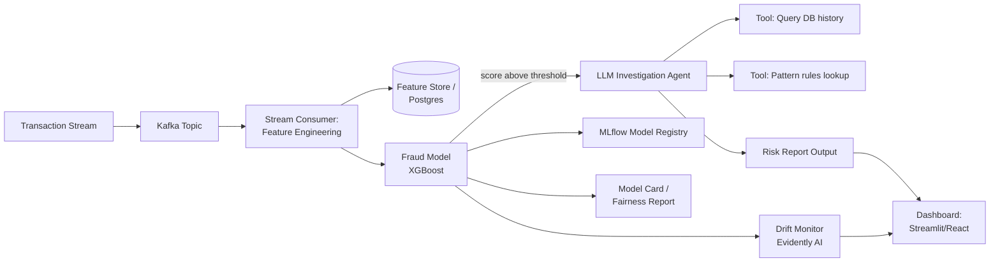
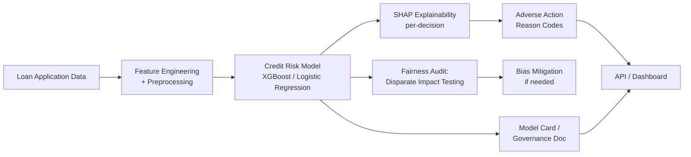

# Fintech Data Science Portfolio Roadmap

**Goal:** Build two connected, banking-relevant projects that demonstrate end-to-end data engineering + ML + LLM/agentic skills + banking-specific rigor (model risk, fairness, explainability) — the exact combination current job postings are screening for.

---

## Why these two projects, in this order

| | Project 1: Fraud Detection | Project 2: Credit Risk Scoring |
|---|---|---|
| Banking use case | Real-time transaction monitoring (ops side) | Loan underwriting (lending side) |
| Core ML problem | Real-time classification on streaming data | Explainable classification on static/batch data |
| Regulatory angle | Model monitoring, audit trails | Fair lending compliance (ECOA, Reg B) |
| Showcases | Streaming/data engineering + agentic AI | Explainability + fairness rigor |

Together they cover the two things almost every bank's data science org actually does, and they tell a coherent story on your resume: *"I build ML systems for banking that are both real-time and compliant."*

---

## PROJECT 1: Real-Time Fraud Detection with LLM Investigation Agent

### 1.1 Problem statement

Banks process thousands of transactions per second. A small fraction are fraudulent, and the cost of missing them (or of falsely blocking legitimate customers) is high. Traditional systems flag suspicious transactions but still require a human analyst to manually investigate each one — slow, inconsistent, and expensive at scale. This project builds a system that (a) flags fraud in real time and (b) auto-generates a trustworthy, evidence-based investigation report for each flagged case.

### 1.2 Architecture

### 1.3 Tech stack (with reasoning)

| Layer | Tool | Why |
|---|---|---|
| Streaming | Kafka or Redpanda | Industry-standard event streaming; Redpanda is easier to self-host for a solo project |
| Language | Python | Universal glue for all layers |
| Storage | Postgres or DuckDB | Simple, real SQL practice |
| Model | XGBoost / LightGBM | Industry default for tabular fraud detection |
| Experiment tracking | MLflow | Real model registry practice, free and self-hostable |
| Agent framework | LangGraph (or a hand-rolled tool-calling loop) | Gives you real "agent" experience — tool calls, not just prompting |
| LLM | Claude or GPT via API (small model is fine, cost matters) | Powers the investigation reports |
| Serving | FastAPI | Standard for Python model APIs |
| Containerization | Docker | Table stakes for any deployment |
| CI/CD | GitHub Actions | Free, widely used |
| Drift monitoring | Evidently AI | Purpose-built for this, free tier |
| Dashboard | Streamlit (fastest) or a small React app (more impressive) | Visualize flagged transactions + agent reports live |

### 1.4 Data source

Start with the **Kaggle Credit Card Fraud Detection dataset** (anonymized real transactions, labeled). Replay it as a simulated stream (write a small script that reads rows and pushes them to Kafka at intervals) — this gives you real streaming mechanics without needing live data access.

### 1.5 Step-by-step build plan

**Phase 1 — Data pipeline (Week 1)**
- Set up Kafka/Redpanda locally (Docker Compose makes this easy)
- Write a producer script that replays the dataset as a live stream
- Write a consumer that computes rolling features: transaction velocity (count in last N minutes), deviation from user's average spend, time-since-last-transaction, geographic jump distance (if location data available)
- Store raw + engineered features in Postgres
- **Learning focus:** Kafka producer/consumer basics, windowed aggregations, SQL schema design

**Phase 2 — Fraud model (Week 1–2)**
- Handle class imbalance (fraud is usually <1% of data) — try SMOTE, class weighting, and focal loss; compare results
- Train XGBoost/LightGBM; tune with cross-validation
- Log every experiment run (params, metrics, artifacts) to MLflow
- Register the best model in MLflow's model registry
- **Learning focus:** imbalanced classification, hyperparameter tuning, experiment tracking discipline

**Phase 3 — LLM investigation agent (Week 2–3)**
- Design the agent's tools: `get_customer_history(customer_id)`, `check_known_patterns(transaction)`, `get_merchant_risk_score(merchant_id)`
- Build the agent loop (LangGraph, or a simple `while` loop with tool-calling) so it reasons step by step rather than one-shotting an answer
- Constrain output format (structured JSON: risk_level, evidence, recommendation) so it's usable downstream, not free-form text
- Add basic guardrails: validate that every "fact" the agent cites actually appears in the tool outputs (a simple string-match check catches a lot of hallucination)
- **Learning focus:** agent design, tool-calling, output validation/guardrails

**Phase 4 — Evaluation harness (Week 3)**
- Build a labeled eval set (a held-out slice of the data with known fraud/non-fraud outcomes)
- Score the ML model: precision, recall, F1, ROC-AUC — prioritize recall (missing fraud is costlier than a false alarm), but report the precision/recall tradeoff explicitly
- Add SHAP values to explain individual predictions
- Score the agent separately: for a sample of reports, manually check — did it cite real facts? Did it recommend something reasonable? Track a "faithfulness rate" (% of claims in the report that are verifiably true from the source data)
- **Learning focus:** model evaluation beyond accuracy, LLM evaluation methodology, SHAP interpretability

**Phase 5 — Model risk & fairness layer (Week 3–4)** *(the banking-specific differentiator)*
- Write a **model card**: one page covering intended use, training data description, known limitations, performance by segment, monitoring plan. (Look up Google's Model Card template for the format — it's the industry standard.)
- Run a basic **fairness audit**: check if flag rates differ meaningfully across transaction amount bands, merchant categories, or (if available) demographic proxies. Report disparate impact ratios.
- Add an **audit log**: every model prediction and every agent decision gets logged with a timestamp and full input/output, so any decision could be reconstructed later
- **Learning focus:** this is literally what banking model risk management teams do — this section is what separates your project from a generic ML portfolio piece

**Phase 6 — Deployment & monitoring (Week 4)**
- Wrap model + agent in a FastAPI service; containerize with Docker
- Deploy to a free-tier host (Render, Fly.io, Railway)
- Build the dashboard: live flagged transactions, agent reports, drift metrics over time
- Set up GitHub Actions: run tests + eval harness on every push, auto-deploy on merge to main
- **Learning focus:** deployment, CI/CD, monitoring in production

### 1.6 Resume bullets this produces

- "Built a real-time fraud detection pipeline using Kafka and XGBoost, processing streaming transactions with automated feature engineering and sub-second scoring"
- "Designed an LLM-powered investigation agent with tool-calling and output validation, reducing manual fraud review effort while maintaining a measured faithfulness rate on generated reports"
- "Built a full evaluation harness covering model performance (precision/recall, SHAP) and LLM reliability (hallucination/faithfulness scoring)"
- "Authored a model card and fairness audit for a fraud detection model, including disparate impact analysis across transaction segments"
- "Deployed the system with Docker, CI/CD via GitHub Actions, and live drift monitoring via Evidently AI"

### 1.7 Timeline: ~4 weeks part-time

---

## PROJECT 2: Credit Risk / Loan Default Scoring with Explainability & Fair Lending Compliance

### 2.1 Problem statement

Every bank that lends money needs to decide who is likely to repay. Unlike fraud detection, this decision is one of the most heavily regulated ML use cases in finance — U.S. fair lending laws (Equal Credit Opportunity Act, Regulation B) legally prohibit models that discriminate on protected characteristics, even unintentionally. This project builds a credit risk model that is not just accurate but demonstrably fair and explainable — which is the actual bar banks hold these models to.

### 2.2 Architecture

### 2.3 Tech stack

| Layer | Tool | Why |
|---|---|---|
| Modeling | XGBoost **and** Logistic Regression | Banks often still use simpler models like logistic regression for credit specifically, *because* regulators demand interpretability — comparing both shows you understand the tradeoff |
| Explainability | SHAP | Industry standard for per-decision explanations |
| Fairness testing | `fairlearn` (Python library) or AIF360 | Purpose-built for exactly this |
| Serving | FastAPI | Consistent with Project 1 |
| Documentation | Markdown model card | Same format as Project 1 for consistency |

### 2.4 Data source

**Kaggle's "Give Me Some Credit"** dataset or the **UCI/Kaggle Home Credit Default Risk** dataset — both are realistic, messy loan application datasets with the kind of features (income, debt ratios, credit history) real underwriting models use.

### 2.5 Step-by-step build plan

**Phase 1 — Data & baseline model (Week 1)**
- Clean and explore the dataset; handle missing values thoughtfully (this data is genuinely messy — a good chance to show real data wrangling)
- Train a baseline logistic regression model (interpretable by design) and an XGBoost model (higher accuracy, less interpretable) — you'll compare these directly

**Phase 2 — Explainability (Week 1–2)**
- Apply SHAP to the XGBoost model to get per-decision explanations
- Generate **adverse action reason codes** for rejected applications — this is a *legal requirement* in the US (lenders must tell rejected applicants why), so implementing it is a strong, specific signal that you understand real banking constraints, not just ML
- Compare: does the logistic regression's built-in interpretability lose much accuracy vs. XGBoost+SHAP? Write up the tradeoff

**Phase 3 — Fairness audit (Week 2)**
- Using `fairlearn`, test for disparate impact across simulated protected-class proxies (e.g., if the dataset has zip code or age, these can proxy for protected characteristics — an important lesson in itself, since proxy discrimination is a real regulatory concern)
- Calculate standard fairness metrics: demographic parity difference, equalized odds difference
- If you find disparities, apply a bias mitigation technique (e.g., reweighting, threshold adjustment per group) and show before/after metrics

**Phase 4 — Governance & deployment (Week 3)**
- Write the model card + a short "fair lending compliance summary"
- Deploy as a simple API with an endpoint that returns a decision + SHAP-based reason codes
- Optional: small dashboard showing approval rates across segments, for transparency

### 2.6 Resume bullets this produces

- "Built and compared interpretable (logistic regression) vs. high-performance (XGBoost + SHAP) credit risk models, quantifying the accuracy-interpretability tradeoff"
- "Implemented automated adverse action reason code generation to meet fair lending disclosure requirements"
- "Conducted a fairness audit using `fairlearn`, identifying and mitigating disparate impact across applicant segments"
- "Authored model governance documentation covering intended use, limitations, and fair lending compliance"

### 2.7 Timeline: ~3 weeks part-time (faster than Project 1 since there's no streaming component)

---

## Suggested overall order

1. Build Project 1 fully (including the model risk/fairness layer) — ~4 weeks
2. Start applying with Project 1 alone; it's already a complete, strong story
3. Build Project 2 in parallel with your job search — it strengthens your pitch specifically for fintech/banking roles as you go
4. In interviews, frame them together: *"I built a real-time fraud system and a credit risk model, covering both the ops side and the lending side of banking ML, with a specific focus on the model governance and fairness requirements banks actually operate under."*

## A note on scope discipline

Don't try to make either project "production-ready" in the enterprise sense (see earlier discussion on scale, redundancy, security) — that's not the bar. The bar is: *real methods, honestly evaluated, clearly documented, with an accurate understanding of what's missing for true production scale.* That last part — knowing and stating the gap — is itself a signal of seniority that many actual junior candidates lack.
