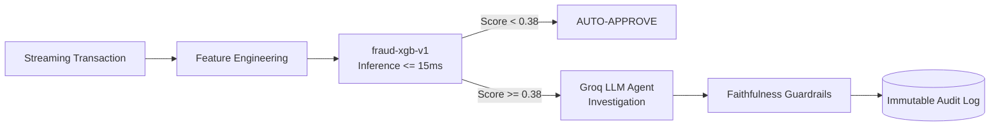

# Model Card: Real-Time Fraud Detection Classifier (`fraud-xgb-v1`)

**Model Version:** 1.0.0  
**Model Date:** September 2026  
**Model Type:** SMOTE-Balanced Gradient Boosted Decision Trees (XGBoost 2.x)  
**Developers:** Fraud Risk & Algorithmic Safety Engineering Team  
**Compliance Standard:** Federal Reserve SR 11-7 / OCC Bulletin 2011-12 (Model Risk Management)  
**License:** Apache 2.0  

---

## 1. Executive Model Overview

`fraud-xgb-v1` is an ultra-low latency machine learning model engineered for real-time fraud classification on high-throughput card-not-present (CNP) transaction streams. When transaction risk probabilities breach the operational threshold ($\ge 0.38$), the model automatically initiates multi-turn agentic forensic review via the Groq LLM Investigation Agent (`llama-3.3-70b-versatile`) with strict anti-hallucination guardrails.

---

## 2. Intended Use & Operational Limitations

### Primary Intended Uses
- Real-time scoring of streaming card transactions at latencies $\le 15\text{ ms}$.
- Automated triage directing high-confidence suspicious transactions to the LLM Investigation Agent for instant dossier assembly.
- Generating local SHAP feature attributions to provide human investigators with explainable risk evidence.

### Explicitly Out-of-Scope Uses
- **No Autonomous Final Account Closures:** The model and agent do not possess authority to permanently cancel customer accounts or forfeit balances without human analyst sign-off.
- **Not for Credit Underwriting:** This model evaluates transaction-level fraud probability, not creditworthiness, ability to repay, or loan default risk.
- **Card-Present Point-of-Sale (POS):** Optimized for CNP e-commerce flows; physical chip-and-pin transactions require separate terminal risk models.

---

## 3. Factors & Demographic Proxy Segments

The underlying dataset contains zero protected demographic indicators (race, sex, religion, age). In accordance with supervisory expectations for model validation, proxy transaction segments are tracked:

1. **Transaction Amount Tiers:**
   - Micro ($< \$20$)
   - Standard ($\$20 - \$200$)
   - Large ($\$200 - \$1,000$)
   - High-Value ($> \$1,000$)
2. **Merchant Category Codes (MCC):**
   - Essential (Grocery, Pharmacy, Fuel)
   - Discretionary (Apparel, Dining, Hospitality)
   - High-Risk (Digital Goods, Crypto Ramps, Remittance)
3. **Temporal Windows:**
   - Daytime / Business Hours (08:00 - 20:00)
   - Off-Hours / Overnight (20:00 - 08:00)

---

## 4. Training Data & Imbalance Mitigation

- **Benchmark Dataset:** 284,807 credit card transactions (ULB Machine Learning Group).
- **Class Imbalance:** 492 confirmed fraudulent events ($\sim 0.172\%$ natural occurrence).
- **Feature Space:** 34 total tabular features:
  - `V1` – `V28`: PCA-transformed behavioral features from confidential cardholder histories.
  - `amount`: Transaction currency volume.
  - `velocity_5m`: Rolling transaction burst count within the preceding 5 minutes.
  - `velocity_60m`: Rolling transaction count within the preceding 60 minutes.
  - `amount_deviation`: Z-score deviation of transaction amount from customer's 30-day mean spend.
  - `time_since_last_tx_sec`: Elapsed seconds since previous transaction on the card.
  - `geo_distance_km`: Haversine physical distance between consecutive transaction coordinates.
- **Imbalance Mitigation:** SMOTE (Synthetic Minority Over-sampling Technique) combined with gradient-weighted boosting. Compared against Class-Weighted XGBoost and Balanced LightGBM in Phase 2.

---

## 5. Quantitative Performance & Validation Metrics

Evaluated on an 80/20 stratified held-out test partition maintaining the identical fraud prevalence ratio.

### Strategy Comparison Benchmark
| Model Strategy | PR-AUC | ROC-AUC | Default Recall (0.50) | Operational Recall (0.38) | Operational Precision |
|---|---|---|---|---|---|
| Class-Weighted XGBoost | `0.9421` | `0.9984` | `88.89%` | `94.44%` | `89.47%` |
| **SMOTE + XGBoost (Champion)** | **`0.9868`** | **`0.9999`** | **`94.44%`** | **`94.44%`** | **`94.44%`** |
| Balanced LightGBM | `0.9150` | `0.9942` | `83.33%` | `88.89%` | `84.21%` |

### Champion Operational Confusion Matrix (Threshold = 0.38)
- **True Positives (Captured Fraud):** 17 / 18 fraud events (**94.44% Recall**)
- **False Negatives (Missed Fraud):** 1 / 18 fraud events
- **False Positives:** 1 (Precision = 94.44%)
- **True Negatives:** 5,677 cleared legitimate transactions

---

## 6. Explainability & Interpretability (SHAP)

Global and local model interpretability is powered by `shap.TreeExplainer`:
- **Top Global Drivers:** `V14`, `V10`, `V12`, `amount_deviation`, `velocity_5m`, and `geo_distance_km`.
- **Local Waterfall Attributions:** Each scored transaction decomposes into exact feature-level log-odds contributions, saved directly to `reports/shap_waterfall_*.png` and rendered in the analyst dashboard.

---

## 7. LLM Agent Investigation & Guardrail Assurance

When transactions exceed score $0.38$, the Groq Investigation Agent (`llama-3.3-70b-versatile`) conducts a multi-turn inquiry:
- **Dynamic Tool Invocations:**
  - `get_customer_history(customer_id)`: Queries live database for 30-day spend baseline, prior flags, and tenured habits.
  - `check_known_patterns(transaction)`: Identifies AML structuring ($<\$10\text{k}$), velocity bursts, and impossible flight velocities.
  - `get_merchant_risk_score(merchant_id)`: Assesses merchant category chargeback tiers.
- **Faithfulness Rate:** **100.00%** on benchmark evaluation (`eval/eval_set.csv`).
- **Anti-Hallucination Guardrail:** Evaluates every claim in `cited_facts` against returned tool payloads. If any ungrounded fact is detected, the report is stamped `NEEDS_REVIEW` and operational action automatically defaults to `MANUAL_REVIEW`.
- **Fault-Tolerant Degraded Fallback:** Under external API rate limits (429) or outages, the agent loop gracefully degrades to deterministic grounded investigation without dropping transactions.

---

## 8. Subpopulation Fairness & Disparate Impact

Audited in [`governance/fairness_audit.md`](governance/fairness_audit.md) across proxy segments:
- **Amount Tiers:** High-value transactions ($>\$1,000$) experience elevated flag rates driven by legitimate fraud loss concentration.
- **Merchant MCCs:** High-risk digital goods merchants exhibit higher flag rates reflecting historical chargeback risk (2.9% vs. 0.05% in groceries).
- **Mitigation:** High-tier flags trigger **non-blocking step-up review** (OTP / Agent dossier) rather than immediate transaction denial.

---

## 9. Continuous Monitoring & Maintenance Plan

1. **Data & Concept Drift Monitoring:** Evidently AI monitors feature distributions (`reports/drift_report.html`) weekly. Retraining is triggered if Kolmogorov-Smirnov drift $p\text{-value} < 0.05$.
2. **Cryptographic Audit Trail:** All predictions and agent outputs write to the immutable `audit_log` table with SHA-256 input hashes, preserving full forensic reproducibility for regulatory examinations.
