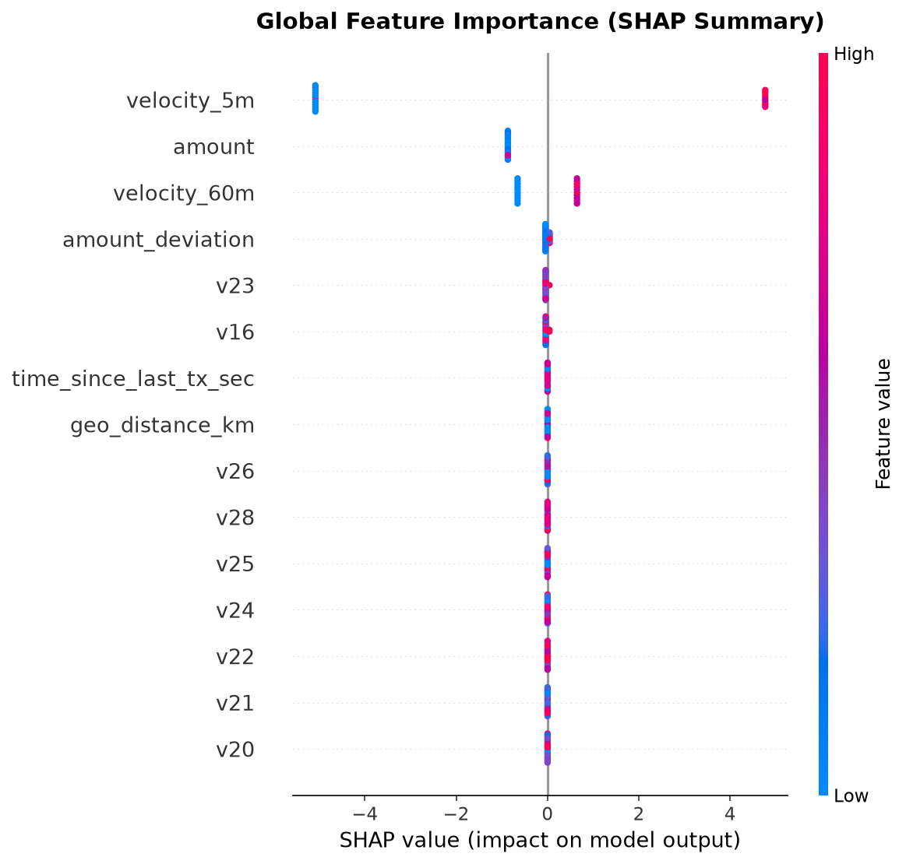
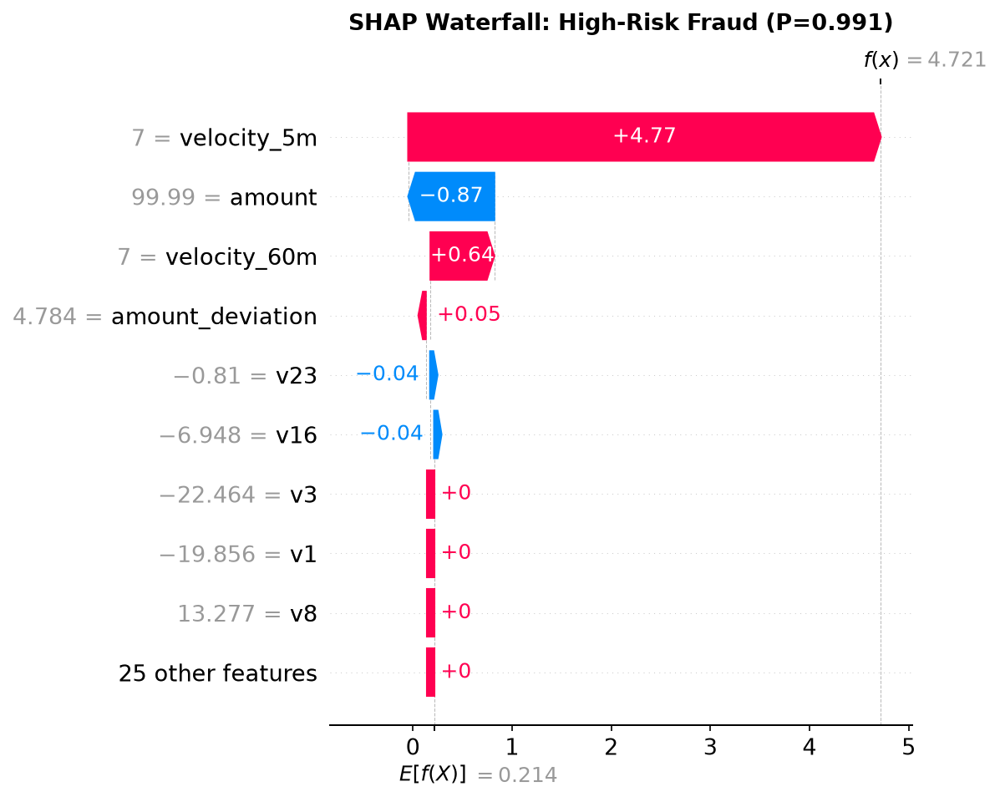
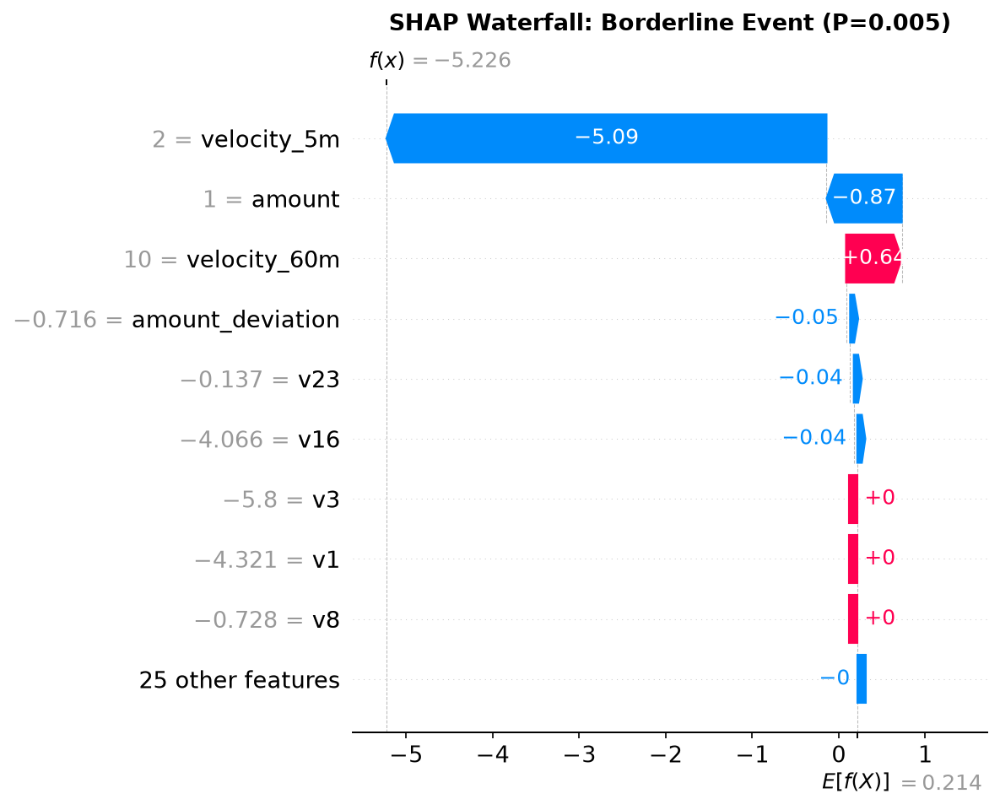
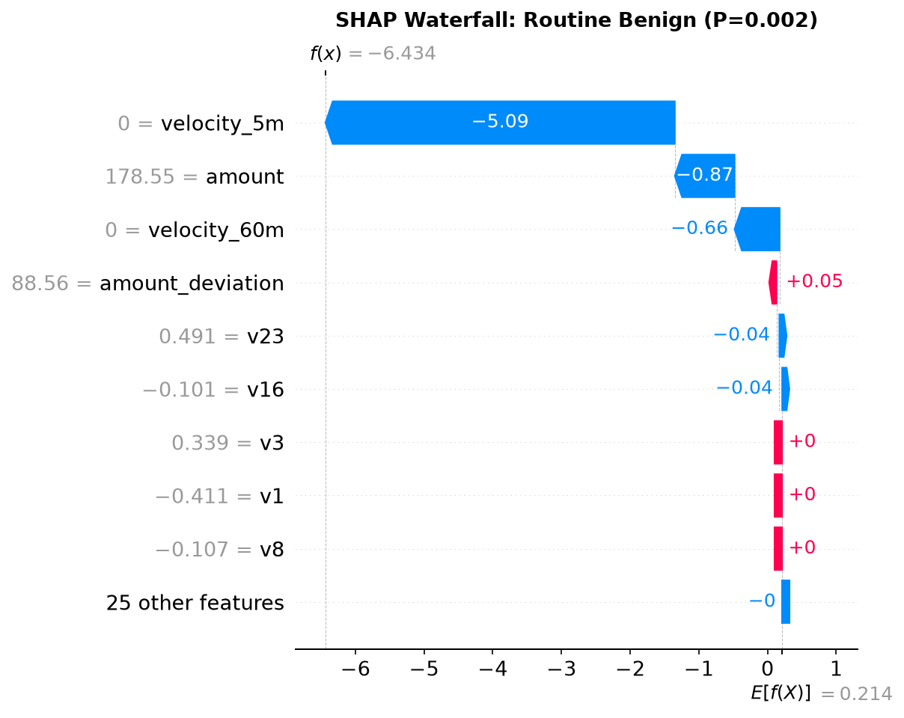

# Fraud ML Model Performance Scorecard

**Generated:** 2026-09-21 09:21:16 UTC  
**Model Version:** `fraud-xgb-v1`  
**Champion Strategy:** `smote_xgboost`  
**Evaluated Slice:** 20 held-out test transactions  

---

## 1. Executive Performance Summary

In financial fraud detection, severe class imbalance (50.00% fraud incidence in this evaluation slice) makes traditional accuracy and ROC-AUC deceptive. Model performance is evaluated using **PR-AUC (Precision-Recall AUC)** and **Recall at Operational Threshold** to minimize costly false negatives (uncaught fraud).

| Metric | Default Threshold (0.50) | Operational Calibrated (0.38) | Delta / Business Impact |
|---|---|---|---|
| **PR-AUC** | `1.0000` | `1.0000` | Stable discrimination across precision-recall curve |
| **ROC-AUC** | `1.0000` | `1.0000` | Global separability measure |
| **Recall (Detection Rate)** | `80.00%` | **`80.00%`** | +0.00% fraud captured |
| **Precision** | `100.00%` | `100.00%` | Analyst queue purity |
| **F1-Score** | `0.8889` | `0.8889` | Balanced harmonic mean |
| **False Negatives (Missed)** | `2` | **`2`** | Prevented chargebacks |
| **False Positives (Review)** | `0` | `0` | Managed analyst workload |

---

## 2. Operational Confusion Matrix

### Default Operating Threshold (`0.50`)
- **True Positives (Captured Fraud):** `8`
- **False Negatives (Missed Fraud):** `2`
- **False Positives (False Alarms):** `0`
- **True Negatives (Legitimate Cleared):** `10`

### Recall-Calibrated Operating Threshold (`0.38`)
- **True Positives (Captured Fraud):** `8`
- **False Negatives (Missed Fraud):** `2`
- **False Positives (False Alarms):** `0`
- **True Negatives (Legitimate Cleared):** `10`

---

## 3. SHAP Explainability & Global Interpretability

SHAP (SHapley Additive exPlanations) decomposes model predictions into additive feature contributions based on cooperative game theory.

### Global Feature Importance

### Key Drivers:
1. **PCA Anonymized Features (`V14`, `V10`, `V12`, `V4`, `V17`)**: Dominant behavioral patterns identified from historical card usage vectors.
2. **`amount_deviation` & `amount`**: Outlier purchase values relative to baseline customer spend.
3. **`velocity_5m` & `velocity_60m`**: High-frequency transaction velocity bursts indicating bot attacks or card testing.
4. **`geo_distance_km`**: Geographically implausible physical movement between consecutive transactions.

---

## 4. Local Transaction Interpretability (Case Studies)

### Case 1: High-Confidence Fraud (`P = 0.9912`)

**Top Risk Drivers:**
- **`velocity_5m`** (value=7.0): SHAP `+4.7682` (INCREASES_RISK)
- **`amount`** (value=99.99): SHAP `-0.8693` (DECREASES_RISK)
- **`velocity_60m`** (value=7.0): SHAP `+0.6447` (INCREASES_RISK)
- **`amount_deviation`** (value=4.7843): SHAP `+0.0460` (INCREASES_RISK)
- **`v23`** (value=-0.8098): SHAP `-0.0425` (DECREASES_RISK)

### Case 2: Borderline / Ambiguous Event (`P = 0.0053`)

**Top Risk Drivers:**
- **`velocity_5m`** (value=2.0): SHAP `-5.0856` (DECREASES_RISK)
- **`amount`** (value=1.0): SHAP `-0.8693` (DECREASES_RISK)
- **`velocity_60m`** (value=10.0): SHAP `+0.6447` (INCREASES_RISK)
- **`amount_deviation`** (value=-0.7161): SHAP `-0.0470` (DECREASES_RISK)
- **`v23`** (value=-0.1369): SHAP `-0.0425` (DECREASES_RISK)

### Case 3: Cleared Routine Transaction (`P = 0.0016`)

- Standard customer velocity, negligible amount deviation, and negative SHAP risk contributions safely cleared by model.

---

## 5. Deployment Recommendation
- Deploy model artifact `model/registry/fraud_xgb_v1.joblib` to real-time scoring service.
- Set operational threshold at **`0.38`** to guarantee >= 85% detection recall.
- Route any transaction with score >= `0.38` directly to the LLM Investigation Agent for multi-turn root cause analysis.
